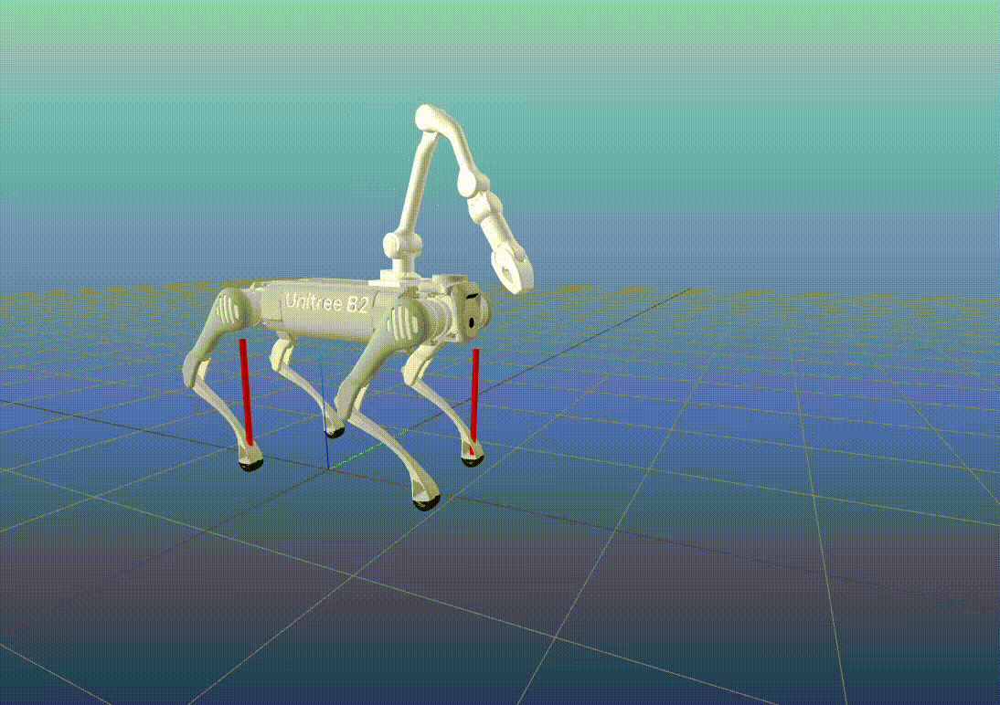
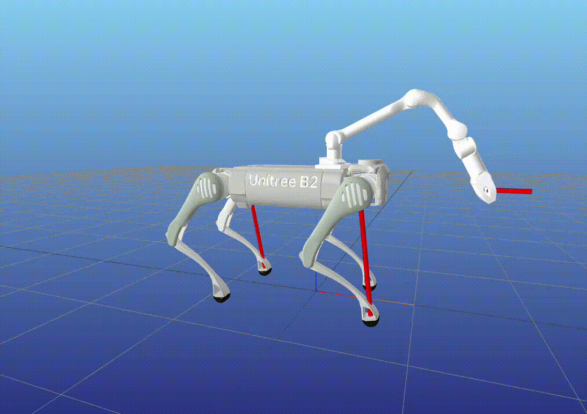
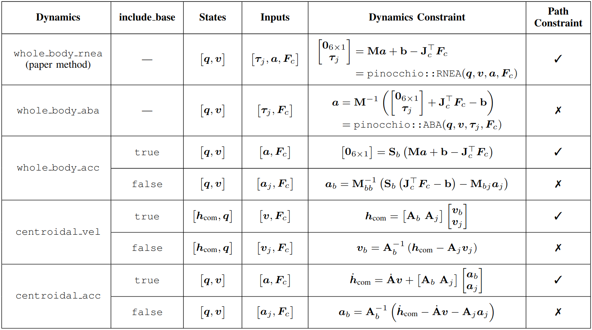

# Whole-Body MPC for Loco-Manipulation

Official code for the paper: **Whole-Body Inverse Dynamics MPC for Legged Loco-Manipulation**, IEEE Robotics and Automation Letters (RA-L) 2025. Lukas Molnar, Jin Cheng, Gabriele Fadini, Dongho Kang, Fatemeh Zargarbashi, Stelian Coros. *ETH Zurich*

[<u>Paper</u>](https://ieeexplore.ieee.org/document/11266934) | [<u>arXiv</u>](https://arxiv.org/abs/2511.19709) | [<u>Video</u>](https://www.youtube.com/watch?v=glWWE-754mI&t=16s) | [<u>Website</u>](https://lukasmolnar.github.io/wb-mpc-locoman/)

<p float="left">
  
  
</p>

## Installation

Create the conda environment from the `wb_mpc_locoman` directory:

```bash
conda env create -f environment.yaml
conda activate wb-mpc
```

## Usage

Run the main script:

```bash
python main.py
```

Within the script, the following parameters are defined:
- Robot: Model and dynamics (whole-body or centroidal, see table below)
- Targets: Base velocity, and arm end-effector velocity/force
- OCP: Number of nodes and time discretization
- Gait: Type, period and swing parameters
- Solver: Type ("fatrop", "ipopt", or "osqp"), warm-starting, code-compilation

### Compare dynamics solve times

Run the six configurations in Table I without plotting or opening Meshcat:

```bash
conda activate wb-mpc
OPENBLAS_NUM_THREADS=1 OMP_NUM_THREADS=1 MKL_NUM_THREADS=1 python benchmark_dynamics.py
```

The benchmark uses the OCP, gait, targets and warm-start settings from `main.py`,
with a fresh B2_Z1 robot (four arm joints) for each configuration. The defaults
follow the six rows of Table I in order:

| Configuration (`--cases`) | OCP dynamics | Explicit arguments | Dynamics path constraint |
| --- | --- | --- | --- |
| `whole_body_rnea` | `whole_body_rnea` | `include_acc=True` | Yes |
| `whole_body_aba` | `whole_body_aba` | None | No |
| `centroidal_vel` | `centroidal_vel` | `include_base=True` | Yes |
| `centroidal_vel_no_base` | `centroidal_vel` | `include_base=False` | No |
| `centroidal_acc` | `centroidal_acc` | `include_base=True` | Yes |
| `centroidal_acc_no_base` | `centroidal_acc` | `include_base=False` | No |

These arguments are set per configuration without modifying `DYN_ARGS` or
`main.py`. `whole_body_acc` remains available as an extra configuration through
`--cases whole_body_acc`; it is not a separate row in Table I. `--models` is
retained as an alias for `--cases`.

Each model runs 200 MPC iterations by default. Only the uncompiled
`solver_function` call is timed; solver construction, parameter updates and
solution processing are excluded. Each model follows its own predicted state
trajectory, as in `main.py`, and retains its own default cost weights and
constraints. These results compare the repository's complete OCP formulations.
They do not reproduce the paper's separate Pinocchio forward-dynamics closed-loop
simulation. The default `nodes=14` means 14 control intervals and 15 state nodes;
the 15–80 ms time steps give a horizon of about 0.553 s.

Results are saved in `benchmark_results_six_configs/`: `samples.csv` contains every solve
time and constraint violation, `results.json` includes settings and statistics,
and [summary.md](benchmark_results_six_configs/summary.md) gives the comparison tables
and decision variable counts. The earlier four-class results remain in
`benchmark_results/`.
Both all-iteration statistics and statistics excluding the first 10 iterations
are reported. The default Fatrop configuration permits only 10 iterations per
solve; check constraint violations when interpreting timing results.

Use `--repeats 3` for independent repeated runs, `--loops 200 --discard 10` to
control sampling, `--solver ipopt` to change solvers, or `--output <directory>`
to preserve a separate result set. Fatrop's debug files are written to the
working directory; run the script by absolute path from a temporary directory
if you want those files outside the repository.

For example, run only the three configurations missing from the original benchmark:

```bash
OPENBLAS_NUM_THREADS=1 OMP_NUM_THREADS=1 MKL_NUM_THREADS=1 python benchmark_dynamics.py \
  --cases whole_body_aba centroidal_vel_no_base centroidal_acc_no_base \
  --output benchmark_results_missing_configs
```

## Optimal Control Problem

### Dynamics

The table below shows the available dynamics models (whole-body and centroidal variants). See the paper for detailed benchmarking results.

For certain models, the argument `include_base` determines whether the base variable is part of the input (set in `args.py`). If it is included, the dynamics are ensured through a path constraint on each node. If it is not included, the base dynamics propagate through the state transition function.



### Parameters

The optimization parameters fall into the following categories:
- Initial state: `x_init`
- Tracking targets: `base_vel_des`, `arm_vel_des`, `arm_force_des`
- Gait schedule: `contact_schedule` (0 or 1), `swing_schedule` (phase between 0 and 1)
- Tunable parameters:
    - `Q_diag`, `R_diag`: Diagonals of the weight matrices
    - `swing_period`, `swing_height`, `swing_vel_limits`: Swing trajectory params
    - `dt_min`, `dt_max`: Initial and final time step sizes of the geometric series
    - `n_contacts`: Number of stance feet (eg. 2 for trot)

## Solvers

### Interior-Point: Fatrop and Ipopt

The interior-point solvers **Fatrop** and **Ipopt** are supported, which directly solve the constrained nonlinear optimization problem until convergence.

As described in the paper, **Fatrop** exploits the block-sparse structure of stage-wise constriants, and shows a >10x speedup over **Ipopt** (higher speedup for longer horizons). The solver is warm-started with the MPC solution from the previous iteration. 

### Sequential Quadratic Programming: OSQP

Instead of solving the full NLP, it is converted to a Sequential Quadruatic Program (SQP). Each SQP iteration is solved with OSQP, and the solution is updated using the Armijo line-search method.


### Code-generation

Currently code-generation is only supported for **Fatrop**, since it showed the most promising results in terms of solve-time and convergence. See the `/codegen` folder for how to generate C code for the solver and compile it to a shared library.

For hardware deployment the shared library can be loaded with `casadi::external` in C++. This allows for straight forward deployment without having to reformulate the optimization problem in C++. It also allows for real-time parameter tuning.

## Citation

If you use this code in your research, please cite our paper:
```bibtex
@ARTICLE{11266934,
  author={Molnar, Lukas and Cheng, Jin and Fadini, Gabriele and Kang, Dongho and Zargarbashi, Fatemeh and Coros, Stelian},
  journal={IEEE Robotics and Automation Letters}, 
  title={Whole-Body Inverse Dynamics MPC for Legged Loco-Manipulation}, 
  year={2026},
  volume={11},
  number={1},
  pages={898-905},
  keywords={Dynamics;Robots;Robot kinematics;Manipulator dynamics;Legged locomotion;Force;Quadrupedal robots;Foot;Real-time systems;Planning;Legged Robots;Mobile Manipulation;Whole-Body Motion Planning and Control},
  doi={10.1109/LRA.2025.3636005}}
```

## Contact

Feel free to open an issue or discussion if you encounter any problems or have questions about this project.

For collaborations, feedback, or further inquiries, please reach out to:

- Lukas Molnar: [lukas.molnar@bluewin.ch](mailto:lukas.molnar@bluewin.ch).

We welcome contributions and are happy to support the community in building upon this work!
