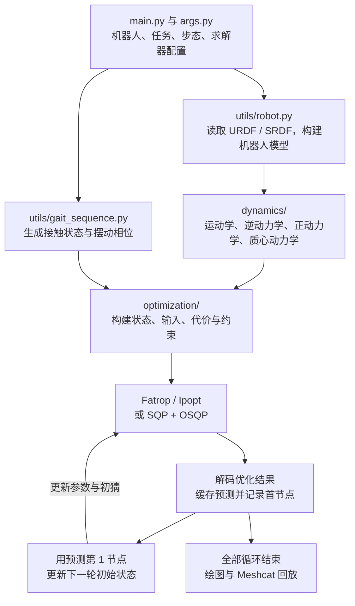

`wb_mpc_locoman` 实现的是一个**四足机器人与机械臂协同运动的全身非线性 MPC 框架**：在同一个优化问题里，联合决定机器人运动、足端接触力、机械臂末端运动，以及近期的关节力矩。

当前 `main.py` 的运行方式是：**求解一段未来轨迹，把预测的下一状态作为新的初始状态，重复求解，最后播放累计轨迹。** 代码中尚未接入独立物理仿真器、传感器反馈或电机控制接口。

下面以当前默认配置 `B2_Z1 + whole_body_rnea + Fatrop` 为主线分析。

---

**模块之间通过“机器人模型 → 动力学函数 → 优化问题 → 滚动求解”连接。**



各部分的职责可以对应到以下文件：

| 位置 | 主要职责 |
|---|---|
| [main.py](/home/tdt/quadrobot/wb_mpc_locoman/main.py:12) | 设置任务、初始化机器人、执行 MPC 循环、统计和回放 |
| [args.py](/home/tdt/quadrobot/wb_mpc_locoman/args.py:1) | 动力学模型选项与求解器参数 |
| [utils/robot.py](/home/tdt/quadrobot/wb_mpc_locoman/utils/robot.py:13) | 加载模型、锁定关节、提取限位和末端 frame |
| [utils/gait_sequence.py](/home/tdt/quadrobot/wb_mpc_locoman/utils/gait_sequence.py:5) | 根据时间生成支撑/摆动状态，以及摆动脚竖直速度 |
| [dynamics/dynamics.py](/home/tdt/quadrobot/wb_mpc_locoman/dynamics/dynamics.py:6) | 提供可求导的运动学、力映射及动力学函数 |
| [optimization/ocp_factory.py](/home/tdt/quadrobot/wb_mpc_locoman/optimization/ocp_factory.py:8) | 根据模型名称创建对应的 OCP |
| [optimization/ocp.py](/home/tdt/quadrobot/wb_mpc_locoman/optimization/ocp.py:11) | 公共参数、接触约束、求解器接口、SQP 和误差计算 |
| `optimization/ocp_*.py` | 各模型的变量定义、动力学约束、权重与解码 |
| `codegen/` | 将求解器导出并编译为共享库 |
| `utils/visualization.py` | 根据优化结果显示机器人和力箭头 |

其中，Pinocchio 负责机器人运动学和动力学；`pinocchio.casadi` 将这些运算转成符号表达式；CasADi 组织优化问题并生成导数；数值求解器负责求解；Meshcat 负责显示。

---

**默认机器人有 16 个参与优化的关节，但完整状态的维度更高。**

入口创建：

```python
robot = B2_Z1(reference_pose="standing_with_arm_up", arm_joints=4)
```

这保留四条腿的 12 个关节和机械臂前 4 个关节，锁定机械臂后两个关节与夹爪。

机器人采用浮动基座模型：

$$
q=
\begin{bmatrix}
p_b\\
Q_b\\
q_j
\end{bmatrix},
\qquad
v=
\begin{bmatrix}
v_b\\
\omega_b\\
v_j
\end{bmatrix}
$$

这里 $Q_b$ 是四元数，因此基座配置用 7 个数表示，基座速度用 6 个数表示。

| 变量 | 默认维度 | 含义 |
|---|---:|---|
| $q$ | 23 | 基座位置 3 + 四元数 4 + 关节角 16 |
| $v$ | 22 | 基座速度 6 + 关节速度 16 |
| $a$ | 22 | 广义加速度 |
| $x=[q,v]$ | 45 | 完整物理状态 |
| $\tau_j$ | 16 | 受驱动关节力矩 |
| $f$ | 15 | 四足三维力 12 + 机械臂末端三维力 3 |

这里有两个容易混淆的顺序：

- 关节数组的腿顺序是 **FL、FR、RL、RR**。
- 接触状态和足端力的顺序是 **FR、FL、RR、RL**，最后再接机械臂末端力。

另外，Pinocchio 浮动基座的 `v[:6]` 使用基座自身坐标系表达；代码中的接触力和 `LOCAL_WORLD_ALIGNED` 末端速度使用世界坐标轴表达。后续接传感器或添加转向任务时，需要明确转换关系。

---

**默认 RNEA 模型把“运动需要多大力矩”直接放进优化约束。**

全身动力学可以写成：

$$
M(q)a+b(q,v)
=
S^\top\tau_j+\sum_e J_e(q)^\top f_e
$$

其中：

- $M(q)$：全身质量矩阵；
- $b(q,v)$：重力、科里奥利和离心项；
- $S^\top\tau_j$：关节驱动力矩，浮动基座部分为零；
- $J_e^\top f_e$：足端及机械臂外力对应的广义力。

RNEA 根据 $q,v,a,f$ 计算所需的广义驱动力：

$$
\tau_{\mathrm{rnea}}
=
M(q)a+b(q,v)-\sum_e J_e^\top f_e
$$

RNEA 属于逆动力学；ABA 则根据力矩和外力计算加速度。这也与 [Pinocchio 官方算法说明](https://docs.ros.org/en/ros2_packages/rolling/api/pinocchio/doc/a-features/g-dynamic.html) 一致。

默认模型在所有阶段施加：

$$
\tau_{\mathrm{rnea}}[0:6]=0
$$

它表达的是：**机器人基座没有直接驱动器，机身运动必须通过关节运动和外界接触力实现。**

在最近的 `tau_nodes` 个阶段，还施加：

$$
\tau_{\mathrm{rnea}}[6:]=\tau_j,
\qquad
-\tau_{\max}\leq\tau_j\leq\tau_{\max}
$$

当前 `tau_nodes=3`，因此输入维度随预测阶段变化：

| 预测阶段 | 优化输入 | 维度 |
|---|---|---:|
| 第 0～2 阶段 | $u_i=[a_i,f_i,\tau_{j,i}]$ | $22+15+16=53$ |
| 第 3～13 阶段 | $u_i=[a_i,f_i]$ | $22+15=37$ |

这是一种明确的计算量取舍：近期保留关节力矩变量、动力学一致性和力矩限位；远期去掉显式关节力矩变量与相应限位。因此，**远期预测状态不具有同等的关节力矩可实现性保证**。[实现位置](/home/tdt/quadrobot/wb_mpc_locoman/optimization/ocp_whole_body_rnea.py:124)

机械臂与腿的耦合也发生在这里。机械臂运动会改变全身惯性和动力学项；机械臂受到的外力会影响机身平衡和足端支撑力。优化器需要同时协调这些量。

---

**优化器实际求的是相对于当前状态的增量，配置恢复时再处理四元数。**

每个预测节点的优化状态为：

$$
\Delta x_i=
\begin{bmatrix}
\delta q_i\\
\delta v_i
\end{bmatrix}
\in\mathbb{R}^{44}
$$

其中 $\delta q_i$ 是 22 维切空间增量。恢复真实状态时：

$$
q_i=\operatorname{integrate}(q_{\mathrm{init}},\delta q_i),
\qquad
v_i=v_{\mathrm{init}}+\delta v_i
$$

`integrate` 由 Pinocchio 实现，负责把姿态增量正确映射到四元数配置。因此，45 维物理状态对应 44 维优化状态增量。[状态映射代码](/home/tdt/quadrobot/wb_mpc_locoman/dynamics/dynamics_whole_body_torque.py:9)

变量按以下顺序排列：

```text
DX[0], U[0], DX[1], U[1], ..., DX[13], U[13], DX[14]
```

所以 `nodes=14` 实际对应：

- 14 个控制区间；
- 15 个状态节点；
- 1,226 个标量决策变量。

计算为：

$$
15\times44+3\times53+11\times37=1226
$$

离散动力学采用：

$$
\delta q_{i+1}=\delta q_i+v_i\,dt_i
$$

$$
\delta v_{i+1}=\delta v_i+a_i\,dt_i
$$

源码中的 $0.5a_i dt_i^2$ 项被注释掉了。严格按实现描述，这是**在本轮初始状态的切空间中累积的一阶离散化**；配置恢复使用流形积分，但阶段之间并未逐次执行 `integrate(q_i, v_i*dt_i)`。

时间网格按等比数列生成：

$$
dt_i=dt_{\min}
\left(\frac{dt_{\max}}{dt_{\min}}\right)^{i/(N-1)}
$$

默认从 15 ms 增长到 80 ms，总预测时域约为：

$$
T=\sum_i dt_i\approx0.553\ \mathrm{s}
$$

近期时间分辨率高，远期时间分辨率低。这里的步长是参数确定的，代码没有把时间步长作为优化变量。[时间网格代码](/home/tdt/quadrobot/wb_mpc_locoman/optimization/ocp.py:77)

---

**代价函数负责表达偏好，接触与末端任务主要通过硬约束表达。**

默认目标大致为：

$$
J=
\sum_{i=0}^{N-1}
\left(
\|\Delta x_i-\Delta x_{\mathrm{des}}\|_Q^2+
\|u_i-u_{\mathrm{des}}\|_R^2
\right)
+
\|\Delta x_N-\Delta x_{\mathrm{des}}\|_Q^2
$$

当前权重体现了以下控制倾向：

- 基座高度偏离参考姿态会受到惩罚。
- 基座 roll、pitch 偏离参考姿态的惩罚较强。
- 基座平面位置和 yaw 姿态的权重为零，主要通过速度目标控制平面运动。
- 腿和机械臂关节倾向于保持参考姿态，同时允许为满足任务而偏离。
- 加速度、接触力和近期关节力矩受到正则化，避免不必要的大输入。

参考足力按前腿约 40%、后腿约 60% 的比例分配重力支撑。远期已经移除的力矩变量在目标表达式中补零，相应阶段没有实际力矩惩罚。[权重与目标实现](/home/tdt/quadrobot/wb_mpc_locoman/optimization/ocp_whole_body_rnea.py:28)

还要注意，阶段代价没有乘 `dt_i`。因此非均匀时间网格下，各节点仍使用同样的权重；调整时间网格会改变代价在物理时间上的分布。

默认任务为：

```python
base_vel_des = [0.1, 0, 0, 0, 0, 0]
arm_vel_des  = [0.1, 0, -0.2]
arm_force_des = [0, 0, 0]
```

它要求基座向前运动，同时机械臂末端相对基座向前、向下运动。机械臂末端速度和外力是等式约束；基座速度主要是代价中的跟踪目标。

代码将机械臂相对速度旋转到世界系，并加上基座平移速度及 $\omega\times r$ 项；其中还单独保留了用户设置的竖直速度。因此这段转换有特定任务假设，需要在推广到大姿态变化时核对。[末端目标转换](/home/tdt/quadrobot/wb_mpc_locoman/optimization/ocp.py:119)

---

**步态时序由外部给定，优化器在该时序下决定运动和接触力。**

`GaitSequence` 生成两个 `4×14` 参数矩阵：

```text
contact_schedule：1 表示支撑，0 表示摆动
swing_schedule：摆动过程中的归一化相位
```

支持的步态为：

| 步态 | 支撑脚数量 | 摆动顺序 |
|---|---:|---|
| `trot` | 2 | FR+RL 与 FL+RR 交替 |
| `walk` | 3 | FL → RR → FR → RL |
| `stand` | 4 | 全部支撑 |

当前 `gait_period=0.8`，所以 trot 每组对角腿摆动 0.4 秒。整个预测窗口根据“当前时间 + 累计预测步长”计算接触状态。[步态实现](/home/tdt/quadrobot/wb_mpc_locoman/utils/gait_sequence.py:26)

共享 OCP 约束包括：

| 对象 | 实际约束 |
|---|---|
| 支撑脚接触力 | $f_z\geq0$，$f_x^2+f_y^2\leq\mu^2f_z^2$，默认 $\mu=0.9$ |
| 摆动脚接触力 | 三维力为零 |
| 支撑脚运动 | 足端三维速度为零 |
| 摆动脚运动 | 竖直速度跟随样条 |
| 机械臂末端 | 三维线速度和三维外力满足设定目标 |
| 关节 | 位置与速度限位 |
| 力矩 | 由具体动力学子类处理 |

摆动脚的竖直速度来自两段三次样条，默认高度参数 0.07 m，抬脚和落脚速度分别为 0.1、−0.2 m/s。

这里约束的是**竖直速度曲线**，没有直接施加足端高度曲线或摆动脚水平轨迹。水平运动由整体优化得到；实际抬脚高度还受离散积分和初始状态影响。

当前还没有地形高度、不穿透、碰撞检测或触地冲击模型，也没有优化接触切换时刻。这些边界决定了它目前更适合分析给定步态下的全身运动与力协调。

对于默认模型，第 0 阶段跳过足端和臂端速度约束，避免与固定初始速度冲突；由于代码中的 `continue`，该阶段的关节位置/速度边界也被跳过。终端节点没有单独添加这些路径约束。[共享约束实现](/home/tdt/quadrobot/wb_mpc_locoman/optimization/ocp.py:145)

---

**一次运行先构建优化问题，再反复更新参数并调用同一个求解器。**

初始化顺序是：

1. 加载机器人和参考姿态。
2. 设置步态，取得足端 frame。
3. 调用 `pin.computeAllTerms()` 更新机器人数据。
4. 创建指定 OCP，建立变量、参数、约束和代价。
5. 设置时间、摆动和跟踪目标。
6. 初始化求解器，进入 MPC 循环。

第三步有实际依赖：OCP 从 `robot.data.mass[0]` 读取质量。本次检查发现，计算前该缓存为 `-1`，计算后约为 `77.268 kg`。单独调用 OCP 工厂时也要确保质量数据已初始化。

默认循环的核心可以直接概括为：

```python
x_init = ocp.x_nom

for k in range(mpc_loops):
    t_current = k * dt_min

    # 更新初态、接触时序和初猜
    ocp.update_params(x_init, t_current)

    # 求出整个预测窗口
    sol_x = solver_function(*ocp.get_solver_params())

    # 缓存整段预测，只记录当前首节点用于回放
    ocp.retract_stacked_sol(sol_x, retract_all=False)

    # 用预测的下一状态继续下一轮
    x_init = ocp.dyn.state_integrate()(
        x_init, ocp.DX_prev[1]
    )
```

这是实际主循环的关键行为。[循环入口](/home/tdt/quadrobot/wb_mpc_locoman/main.py:46)

两类输出列表承担不同职责：

| 数据 | 存储内容 |
|---|---|
| `DX_prev`、`U_prev` | 最近一次求解的完整预测窗口 |
| `q_sol`、`v_sol`、`a_sol`、`forces_sol`、`tau_sol` | 每次 MPC 首节点追加形成的历史轨迹 |

`retract_all=False` 仍然缓存完整预测，只限制历史记录的追加范围。[解码与记录实现](/home/tdt/quadrobot/wb_mpc_locoman/optimization/ocp_whole_body_rnea.py:294)

因此，默认 200 次循环推进约 3 秒的模型时间。程序没有向电机发送 $\tau_0$，也没有通过物理引擎施加该力矩后读取下一状态。

---

**三种求解器共用优化模型，但数值求解路径不同。**

| 求解方式 | 工作方式 | 当前迭代配置 |
|---|---|---|
| Fatrop | 求解具有阶段结构的非线性规划 | 最多 10 次迭代，容差 `1e-3` |
| Ipopt | 求解非线性规划 | 最多 100 次迭代，容差 `1e-3` |
| SQP + OSQP | 外层线性化非线性约束，内层求解 QP | 2 轮 SQP，每个 QP 最多 20 次迭代 |

Fatrop 和 Ipopt 在主程序中实际通过：

```python
ocp.opti.to_function(...)
```

封装成 `solver_function`。它接收初态、接触时序、权重、目标和初猜，返回堆叠优化变量。CasADi 官方文档也说明，函数化调用可以减少反复使用 `set_initial → solve → value` 的接口开销。[CasADi 文档](https://web.casadi.org/docs/)

OSQP 分支则由代码自己实现 SQP，每轮构造：

$$
\min_{\delta z}
\frac{1}{2}\delta z^\top P\delta z+
\nabla J(z)^\top\delta z
$$

$$
l-g(z)\leq J_g(z)\delta z\leq u-g(z)
$$

之后用线搜索更新 $z$。这里 $P$ 使用初始化时目标 Hessian 的对角值，没有加入非线性约束的二阶项。[求解器实现](/home/tdt/quadrobot/wb_mpc_locoman/optimization/ocp.py:292)

当前 warm start 也有特定实现：

- 状态增量直接沿用上一轮相同索引的数据。
- 加速度和力矩沿用上一轮对应数据。
- 足端力重新设置为重力分配，并按新步态将摆动脚力清零。
- RNEA 的机械臂力初猜设置为目标外力。

常规路径没有对轨迹执行时间前移和完整的状态重新表达。虽然存在 `warm_start_interpolate()`，主循环没有调用它；主函数接口也没有传递和返回约束乘子。[热启动实现](/home/tdt/quadrobot/wb_mpc_locoman/optimization/ocp_whole_body_rnea.py:190)

---

**五种动力学选项主要是在比较不同的状态和输入参数化。**

下表按当前 `args.py` 中 `include_base=True`、`include_acc=True` 的设置说明：

| 模型 | 状态 | 输入 | 核心动力学处理 |
|---|---|---|---|
| `whole_body_rnea` | $q,v$ | $a,f,\tau$，远期移除 $\tau$ | 通过逆动力学等式约束运动与力矩 |
| `whole_body_aba` | $q,v$ | $\tau,f$ | 通过正动力学计算加速度 |
| `whole_body_acc` | $q,v$ | $a,f$ | 约束浮动基座动力学 |
| `centroidal_acc` | $q,v$ | $a,f$ | 约束质心动量变化与全身加速度的关系 |
| `centroidal_vel` | $\bar{h},q$ | $v,f$ | 积分质心动量，并约束动量与广义速度的一致性 |

其中 $\bar{h}=h/m$ 是质量归一化的质心动量。

`centroidal_acc` 仍保留全身 $q,v$，利用完整机器人的质心动量矩阵：

$$
A(q)a+\dot{A}(q,v)v=\dot{h}
$$

因此不能把它理解为只保留一个质点、完全忽略机械臂和腿的构型。

`include_base=False` 的作用是消去输入里的基座速度或加速度，用动力学关系计算它们，从而减少优化变量。

模型切换时，力矩处理也会改变：

- RNEA 近期使用完整逆动力学力矩约束。
- ABA 全时域保留力矩输入，但当前也只在近期加硬限位。
- 两个 acceleration 模型与 centroidal velocity 模型的近期力矩限位使用 `tau_estimate(q, forces)`；它没有完整惯性和速度相关项，不能视为完整逆动力学力矩保证。

因此这些模型不是只换一个名称就完全等价的控制器。[力矩估计函数](/home/tdt/quadrobot/wb_mpc_locoman/dynamics/dynamics.py:63)

---

**回放、共享库运行和真实机器人闭环，是三个不同的运行环节。**

当前程序完成全部 MPC 循环后，才初始化 viewer，并以 `dt_min` 为间隔回放历史轨迹 50 遍。红色力箭头根据优化力绘制，只用于显示；`plot=False` 关闭的是 Matplotlib 曲线，不会关闭最后的机器人回放。[回放代码](/home/tdt/quadrobot/wb_mpc_locoman/main.py:196)

设置 `compile_solver=True` 后，Fatrop 路径可以生成：

```text
solver_function.c：参数化求解器
retract_solution.c：优化变量到 q、v、a、f、tau 的解码函数
```

随后通过 CMake 链接 Fatrop、Blasfeo，构建共享库，并用 `ca.external` 或 C++ 的 `casadi::external` 调用。当前 CMake 只构建求解器文件，解码函数还需要单独纳入部署构建。[编译配置](/home/tdt/quadrobot/wb_mpc_locoman/codegen/CMakeLists.txt:8)

若接入 Webots、MuJoCo 或真实机器人，需要把主循环中的状态自推进替换成反馈闭环：

```text
读取并估计实际状态
        ↓
更新 OCP 参数
        ↓
求解并检查有效性
        ↓
取首步力矩/运动参考，交给执行层
        ↓
机器人或仿真器演化
        ↓
再次读取实际状态
```

需要补齐的主要接口是状态估计、关节与坐标映射、控制执行、时序调度和求解失败处理。

---

**源码中还有几处会影响扩展和运行解释的细节。**

- **约束误差目前只用于打印。** 主循环计算 `CV (inf norm)` 后继续采用预测状态，没有根据误差拒绝结果或进入恢复控制。因此循环执行完成不能单独证明解有效。
- **零力可视化存在除零问题。** `force / norm(force)` 没有处理零力，默认臂力和摆动脚力都可能触发 NaN。[位置](/home/tdt/quadrobot/wb_mpc_locoman/utils/visualization.py:23)
- **带机械臂的 `centroidal_vel` 有状态切片不一致。** 公共代码使用 `x_init[:nq]` 取配置，但该模型的状态布局是 `[h,q]`，配置应从第 6 维之后读取；这个问题不适用于状态为 `[q,v]` 的 `centroidal_acc`。
- **代码生成有参数联动要求。** RNEA 默认生成前三步解码函数，要求这三步输入结构一致，即 `tau_nodes≥3`；降低该参数时也要调整生成逻辑。
- **关节数量变化需要配套调整绘图。** 当前图例固定为 12 个腿关节加 4 个臂关节，改成六关节机械臂并启用绘图时需要同步修改。

这些是源码分析发现的具体限制，本次没有修改它们。

最后补充本次实际验证结果：我在新建的 `wb-mpc` 环境中，按 `main()` 的完整初始化顺序构建了默认问题，并运行两轮 MPC：

| 检查项 | 结果 |
|---|---|
| 优化变量 | 1,226 |
| CasADi 约束行数 | 1,773 |
| 预测时域 | 约 0.553 s |
| 第一轮求解时间 / CV | 约 70.9 ms / $5.1\times10^{-10}$ |
| 第二轮求解时间 / CV | 约 43.0 ms / $1.9\times10^{-6}$ |

两轮的约束违反量都很小，但实际求解时间超过 15 ms 状态推进步长。**15 ms 表示当前模型时间的推进间隔，不能据此认定程序达到 66.7 Hz 实时控制。**

此前我提到的较大约束误差来自遗漏质量缓存初始化的简化测试，应以本次结果修正；本次未执行完整 200 轮，也未验证可视化和实机闭环。